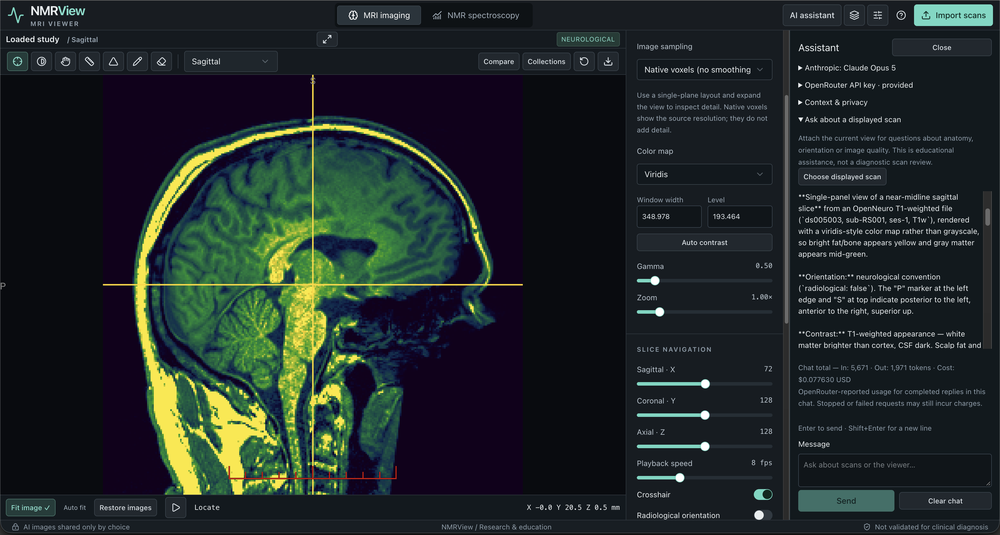

# NMRView



**MRI imaging and NMR spectroscopy in your browser.**

NMRView is a responsive research and education workstation for viewing MRI volumes, comparing scans, annotating anatomy, and analyzing laboratory 1D/2D NMR spectra and tissue MR spectroscopy (MRS). Its name refers to nuclear magnetic resonance, the physics behind MRI and NMR spectroscopy.

> Research and education software. Not validated or certified for diagnosis or clinical decision-making.

## Features

- Empty MRI workspace at startup: nothing is downloaded or displayed until you explicitly import a scan or open a repository record. No smoothing by default.
- GPU-rendered multiplanar and 3D MRI views with layers, contrast controls, slice navigation, and 4D frame playback.
- Participant comparison, acquisition metadata, persistent measurements and manual labels, and portable session exports.
- Local volume and DICOM import, plus direct access to compatible public OpenNeuro and Zenodo data, plus complete MRI series from Imaging Data Commons (IDC) and a dedicated TCIA collection browser backed by IDC.
- Laboratory 1D/2D and tissue NIfTI-MRS workflows, with spatial localization, reversible processing, quality review, and acquisition-matched research basis fitting.
- In-app Zenodo browsing for tissue MRS and 2D NMR, OpenNeuro MRS dataset lookup, and automatic discovery of optional acquisition notes and compatible Zenodo basis files.
- Processed 1D spectroscopy: overlays, peak picking, integration, referencing, baseline correction, and export.
- Optional OpenRouter assistant with your own key, model selection, explicitly shared scan snapshots, suggested location dots, and reported token usage/cost.
- Session reset clears loaded MRI and spectroscopy data, background processing and AI state, while retaining saved collections.
- Desktop and mobile layouts with controls that leave room for the images.

## Start a fresh session

Select **Reset session** (the circular arrow in the top bar) and confirm to restart with empty viewers. Save any work first: loaded scans, spectra, unsaved annotations and the AI conversation are cleared. Saved collections, saved annotations, exported files and the saved OpenRouter key remain available.

The reset page keeps `?session=empty` in its URL so refreshing or switching workspaces does not automatically reload spectroscopy samples or the previous collection. You can import scans or open saved collections. Reset releases the old session's memory; it does not erase the browser's disk cache. See the [user guide](docs/USER_GUIDE.md#reset-the-session).

## Choose a spectroscopy workflow

Open **NMR spectroscopy** and select the view that matches your data:

| View | Input | Get started |
| --- | --- | --- |
| Laboratory NMR | Processed 1D JCAMP-DX or ppm/intensity CSV/TSV; complex CSV is also supported | Use **Import scans** for the existing local or public-repository importer. |
| 2D NMR | Processed 2D JCAMP-DX or a complete `f2_ppm,f1_ppm,intensity` CSV grid | Open **Browse online acquisitions**, search Zenodo or enter a record ID, then load a file. |
| Tissue MRS | Complex time-domain NIfTI-MRS (`.nii` / `.nii.gz`) | Browse Zenodo or enter an OpenNeuro dataset ID, then load an acquisition. |

A tissue-MRS acquisition alone is enough to display, process, compare and export spectra. A basis set is optional for metabolite fitting; a matching, registered MRI is optional for anatomical localization. Ordinary MRI volumes do not contain the required spectroscopy signal. Line broadening defaults to **0 Hz**.

Repository lists in the 2D and tissue-MRS views show candidate file types and sizes; contents are validated during import. See the [spectroscopy guide](docs/SPECTROSCOPY.md) for supported formats, acquisition requirements and current limitations.

## Run locally

Requires Node.js 22.13 or newer and npm.

```sh
git clone https://github.com/thepacket/nmrview.git
cd nmrview
npm ci
npm run dev
```

Open http://localhost:5173/. MRI rendering requires a browser and GPU supporting WebGL2. Large studies may exceed available memory, particularly on mobile devices.

```sh
npm run typecheck
npm test
npm run build
```

The build is a static export in `dist/client`: the whole application runs in the browser and needs no application server. `npm start` serves that export locally at http://127.0.0.1:4173/ for a production check.

## Deploy

The repository ships a [Dockerfile](Dockerfile) that builds the export and serves it with an unprivileged nginx ([deploy/nginx.conf](deploy/nginx.conf)), plus a [fly.toml](fly.toml) for [Fly.io](https://fly.io/). No secrets, databases or environment variables are required; the OpenRouter key is entered by each user in the browser and never reaches the server.

```sh
fly launch --copy-config --no-deploy   # first time: creates the app named in fly.toml
fly deploy
```

Subsequent releases are `fly deploy` again. The image can also run anywhere Docker runs:

```sh
docker build -t nmrview .
docker run --rm -p 8080:8080 nmrview
```

The nginx configuration never re-encodes binary or already-gzipped files, sets `application/wasm` for the bundled DICOM converter, and serves the JCAMP samples as plain text. Keep those rules if you serve the export from another host: the viewer reads `.nii.gz` files by their bytes, and WebAssembly needs its MIME type for streaming compilation.

## Documentation

- [IDC MRI browsing](docs/IDC.md): searchable MRI collections, participant/examination grouping, complete DICOM-series loading and access limits.

- [Spectroscopy workflows](docs/SPECTROSCOPY.md): 1D/2D NMR, tissue MRS, quality, fitting, maps, and limitations.
- [User guide](docs/USER_GUIDE.md): viewing controls, supported formats, online sources, spectroscopy, AI, limits, and verification.
- [Contributing](CONTRIBUTING.md): development workflow and focused checks.
- [Security and privacy](SECURITY.md): reporting vulnerabilities and handling sensitive information.
- [Third-party notices](THIRD_PARTY_NOTICES.md): software and sample-data licensing.
- [Discussions](https://github.com/thepacket/nmrview/discussions): questions, ideas, and workflow feedback.
- [Issues](https://github.com/thepacket/nmrview/issues): reproducible bugs and feature requests.

## Scope and privacy

Scans are processed in the browser. Optional AI messages and explicitly attached viewport images go directly to OpenRouter and the selected provider. The API key is saved in this browser's local storage until you choose Forget key; set a spending limit on it. Review the sharing preview and provider policies before sending information. Local storage and exported sessions can contain sensitive metadata or image data; use synthetic or openly licensed, de-identified examples when reporting problems.

Images used as layers must already be registered. Comparison linking does not perform anatomical registration. Automated segmentation, raw vendor-FID processing, absolute metabolite quantification, PACS/DICOMweb integration, and clinical validation are outside the current scope. AI dots are approximate suggestions on a frozen snapshot, not validated anatomical landmarks.

## License

Copyright (c) 2026 Andre Paquette.

Original NMRView code and documentation are licensed under the [MIT License](LICENSE). Bundled third-party code and sample data retain their own licenses; see [third-party notices](THIRD_PARTY_NOTICES.md). The MIT license does not relicense downloaded datasets or remove their attribution requirements.
